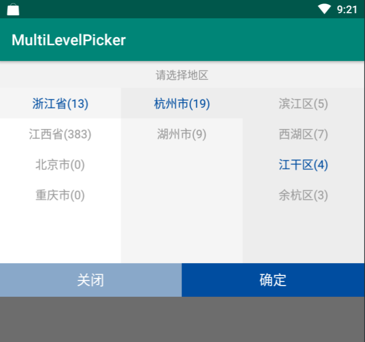

# MultiLevelPicker

Android三级菜单选择器。

- 支持三级选择
- 支持选项降级(当选中的选项在更新菜单后, 会进行降级)
- 支持AndroidX


## 效果展示


## 依赖

```groovy
implementation "wang.relish.widget:multilevelpicker:1.0.0"
```

## 如何使用

此组件的适用场景较少, 建议修改源码以适配你的业务场景。

### 1 你的数据需要实现Node接口
```java
public interface Node {
    /**
     * 标记唯一性
     *
     * @return -1 when it is root
     */
    long id();

    /**
     * 显示文案
     */
    @NonNull
    String text();

    /**
     * 被选中的Id
     *
     * @return -1 when {@link #children()} is null
     */
    long selectedChild();

    void setSelectedChild(long id);

    /**
     * 子树(为空表示是叶节点)
     *
     * @return null when it is a leaf
     */
    @Nullable
    List<? extends Node> children();

    /**
     * 返回被选中的child
     */
    Node getSelectedChild();
}
```
### 2 使用三级菜单选择器
```java
MultiLevelPickerWindow window = new MultiLevelPickerWindow<>(this);
window.setOnSelectListener(new MultiLevelPickerWindow.OnSelectAdapter<NodeImpl>() {
    @Override
    public void onSelect(int level, NodeImpl nodeImpl) {
        // 选中选项回调
    }

    @Override
    public void onDownGraded(int selectLevel, NodeImpl nodeImpl) {
        // 启动降级策略
        // selectLevel: 2 1 0 -1(选中的整个组都没了)
    }

    @Override
    public void onShow() {
        // 当弹窗显示时
    }

    @Override
    public void onDismiss() {
        // 当弹窗隐藏时
    }
});
window.updateData(generate(this));// 更新数据(可能会在此时启动降级策略)
window.show(tvText);// 弹窗显示
```

### 可配置的值

可配置的文案或样式(在主工程覆盖值即可):
```xml
<!--###################### 可修改颜色值 ######################-->
<!-- 三级菜单的背景色(每一级的选中背景色用下一级的背景色) -->
<color name="mlp_bg_level_1">#FFFFFF</color>
<color name="mlp_bg_level_2">#F5F5F5</color>
<color name="mlp_bg_level_3">#EDEDED</color>

<!-- 选中选项的字体高亮色 -->
<color name="mlp_item_selected_text">#FFFFDA44</color>
<!-- 未选中选项的字体高亮色 -->
<color name="mlp_item_unselected_text">#999999</color>

<!-- "关闭"、"确定"的字体色和背景色 -->
<color name="mlp_close_btn_text">#333333</color>
<color name="mlp_close_btn_bg">#FFFFF4C8</color>
<color name="mlp_confirm_btn_text">#333333</color>
<color name="mlp_confirm_btn_bg">#FFFFDA44</color>

<!--###################### 可修改文案值 ######################-->
<!-- 左侧关闭按钮的文案 -->
<string name="mlp_close_text">关闭</string>
<!-- 右侧侧关闭按钮的文案 -->
<string name="mlp_confirm_text">确定</string>
```

## 混淆

无

